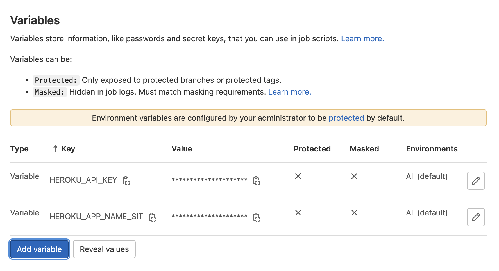

# Deploy angular app on heroku (CICD Gitlab)

Implement Continuous Deployment/Delivery for an Angular frontend app on heroku cloud using Gitlab CICD

## Setup Heroku app

* Create Heroku account (https://signup.heroku.com/)
* Login and navigate to `Account Settings` from Profile menu
* Generate a new API key
* Navigate to the apps page (https://dashboard.heroku.com/apps)
* Create a new app and choose your preferred region
* Install heroku CLI `npm install -g heroku`
* Login to heroku `heroku login`  and complete login from browser

## Setup Gitlab CICD with heroku

* Login to your Gitlab account 
* Go to Settings -> CI/CD -> Variables and Add the following variables
    * Variable Key : HEROKU_API_KEY , Variable Value : <your_generated_heroku_API_Key>
    * Variable Key : HEROKU_APP_NAME_SIT , Variable Value : <your_app_name>
    
* In `package.json` file add following scripts
    ```json
        "heroku-postbuild": "ng build -c=sit",
        "start:sit": "ng serve -c=sit --port=4202"
    ```
* Update the `start` script in package.json
    ```json
        "start": "node server.js",
    ```
* Add `express.js` dependency to your project
    ```json
        "dependencies": {
            "express": "^4.17.2",
        }
    ```
* Add the below node script to create a node server to serve the built angular file
    ```javascript
        const path = require('path');
        const express = require('express');
        const app = express();
        const forceSSL = function() {
            return function (req, res, next) {
                if (req.headers['x-forwarded-proto'] !== 'https') {
                    return res.redirect(['https://', req.get('Host'), req.url].join(''));
                }
            next();
            }
        }
        app.use(forceSSL());
        app.use(express.static(__dirname + '/dist/<project_name>'));
        app.get('/*', function(req, res) {
            res.sendFile(path.join(__dirname + '/dist/<project_name>/index.html'));
        });
        app.listen(process.env.PORT || 8081);
    ```
* Add the below `.gitlab-ci.yml` file
    ```yaml
        image: node:latest

        before_script:
            - apt-get update -qy
            - apt-get install -y ruby-dev
            - gem install dpl

        deploy-sit:
            extends: .node-sit-base
            stage: web-install-sit
    ```
* Push your code changes to `sit` branch
* Push code to the heroku app 
    ```shell
        git push heroku sit:main
    ```
* Your CI/CD should start the deployment
    * It builds the angular project first using `ng build -c=sit`
    * Starts the `server.js`